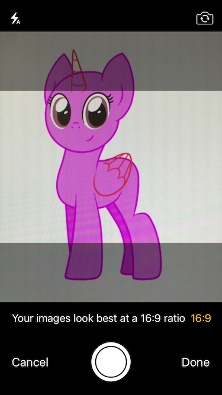
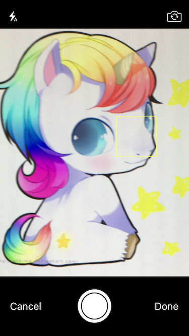
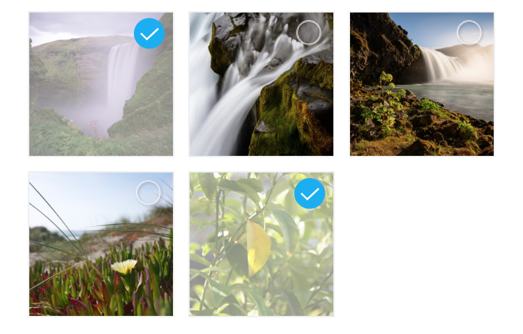

# react-native-camera-kit

Native camera control.

  

## Installation


#### Install using npm or yarn:

```bash
npm install react-native-camera-kit --save
```

Or if you're using yarn:

```bash
yarn add react-native-camera-kit
```

#### iOS

- Locate the module lib folder in your node modules: `PROJECT_DIR/node_modules/react-native-camera-kit/ios/lib`
- Drag the `ReactNativeCameraKit.xcodeproj` project file into your project
- Add `libReactNativeCameraKit.a` to all your target **Linked Frameworks and Libraries** (prone to be forgotten)
- Add to your project ```info.plist``` the keys ```Privacy - Camera Usage Description``` and ```Privacy - Photo Library Usage Description``` as described [here](https://developer.apple.com/library/content/documentation/General/Reference/InfoPlistKeyReference/Articles/CocoaKeys.html).

#### Android

Add the following to your project's `settings.gradle` file:


```diff
+ include ':rncamerakit'
+ project(':rncamerakit').projectDir = new File(rootProject.projectDir, '../node_modules/react-native-camera-kit/android/')
```

Then add to your app `app/build.gradle` in the `dependencies` section:

```diff
+ compile project(":rncamerakit")
```

Then in `MainApplication.java` add:

```diff
+ import com.rncamerakit.RNCameraKitPackage;
```

And in the package list in the same file (e.g. `getPackages`) add:

```diff
+ new RNCameraKitPackage()
```

## Running the example project	

- ```yarn bootstrap```	
- ```yarn example ios``` or ```yarn example android``` 

## APIs

### CameraKitCamera - Camera component 

```js
import { CameraKitCamera } from 'react-native-camera-kit';
```
```jsx
<CameraKitCamera
  ref={cam => this.camera = cam}
  style={{
    flex: 1,
    backgroundColor: 'white'
  }}
  cameraOptions={{
    flashMode: 'auto',                // on/off/auto(default)
    focusMode: 'on',                  // off/on(default)
    zoomMode: 'on',                   // off/on(default)
    ratioOverlay:'1:1',               // optional
    ratioOverlayColor: '#00000077'    // optional
  }}
  onReadCode={event =>                // optional
    console.log(event.nativeEvent.codeStringValue)
  }
  resetFocusTimeout={0}               // optional
  resetFocusWhenMotionDetected={true} // optional
/>
```

Prop | Type | Description
-------- | ----- | ------------
`resetFocusTimeout`          | Number  | iOS only. Dismiss tap to focus after this many milliseconds. Default `0` (disabled). Example: `5000` is 5 seconds.
`resetFocusWhenMotionDetected` | Boolean | iOS only. Dismiss tap to focus when focus area content changes. Native iOS feature, see documentation: https://developer.apple.com/documentation/avfoundation/avcapturedevice/1624644-subjectareachangemonitoringenabl?language=objc). Default `true`.
`saveToCameraRoll` | Boolean | Using the camera roll is slower than using regular files stored in your app. On an iPhone X in debug mode, on a real phone, we measured around 100-150ms processing time to save to the camera roll. *<span style="color: red">**Note:**</span> This only work on real devices. It will hang indefinitly on simulators.*
`saveToCameraRollWithPhUrl` | Boolean | iOS only. If true, speeds up photo taking by about 5-50ms (measured on iPhone X) by only returning a [rn-cameraroll-compatible](https://github.com/react-native-community/react-native-cameraroll/blob/a09af08f0a46a98b29f6ad470e59d3dc627864a2/ios/RNCAssetsLibraryRequestHandler.m#L36) `ph://..` URL instead of a regular `file://..` URL.
`cameraOptions`                      | Object  | See `cameraOptions` below

### cameraOptions

Attribute         | Values                 | Description
----------------- | ---------------------- | -----------
`flashMode`         |`'on'`/`'off'`/`'auto'` | Camera flash mode (default is `auto`)
`focusMode`         | `'on'`/`'off'`         | Camera focus mode (default is `on`)
`zoomMode`          | `'on'`/`'off'`         | Camera zoom mode
`ratioOverlay`      | `['int':'int', ...]`   | Show a guiding overlay in the camera preview for the selected ratio. Does not crop image as of v9.0. Example: `['16:9', '1:1', '3:4']`
`ratioOverlayColor` |  Color                 | Any color with alpha (default is ```'#ffffff77'```)

### CameraKitCamera API

#### checkDeviceCameraAuthorizationStatus

```js
const isCameraAuthorized = await CameraKitCamera.checkDeviceCameraAuthorizationStatus();
```

return values:

`AVAuthorizationStatusAuthorized` returns `true`

`AVAuthorizationStatusNotDetermined` returns `-1`

otherwise, returns ```false```

#### requestDeviceCameraAuthorization

```js
const isUserAuthorizedCamera = await CameraKitCamera.requestDeviceCameraAuthorization();
```

`AVAuthorizationStatusAuthorized` returns `true`

otherwise, returns `false`

#### capture({ ... }) - must have the wanted camera capture reference

Capture image (`{ saveToCameraRoll: boolean }`). Using the camera roll is slower than using regular files stored in your app. On an iPhone X in debug mode, on a real phone, we measured around 100-150ms processing time to save to the camera roll.

```js
const image = await this.camera.capture();
```

#### setFlashMode - must have the wanted camera capture reference

Set flash mode (`auto`/`on`/`off`)

```js
const success = await this.camera.setFlashMode(newFlashData.mode);
```

#### setTorchMode - must have the wanted camera capture reference

Set Torch mode (`on`/`off`)

```js
const success = await this.camera.setTorchMode(newTorchMode);
```

#### changeCamera - must have the wanted camera capture reference

Change to front/rear camera

```js
const success = await this.camera.changeCamera();
```
 

### CameraKitGalleryView - Gallery grid component

Native Gallery View (based on `UICollectionView`(iOS) and ` RecyclerView` (Android))



```js
import { CameraKitGalleryView } from 'react-native-camera-kit';

<CameraKitGalleryView
  ref={gallery => this.gallery = gallery}
  style={{flex: 1, marginTop: 20}}
  minimumInteritemSpacing={10}
  minimumLineSpacing={10}
  albumName={<ALBUM_NAME>}
  columnCount={3}
  onTapImage={event => {
    // event.nativeEvent.selected - ALL selected images ids
  }}
  selectedImages={<MAINTAIN_SELECETED_IMAGES>}
  selectedImageIcon={require('<IMAGE_FILE_PATH>'))}
  unSelectedImageIcon={require('<IMAGE_FILE_PATH>')}
/>
```

Attribute | Values | Description
-------- | ----- | ------------
`minimumInteritemSpacing`        | Float             | Minimum inner Item spacing
`minimumLineSpacing`             | Float             | Minimum line spacing
`imageStrokeColor`               | Color             | Image stroke color
`imageStrokeColorWidth`          | Number > 0        | Image stroke color width 
`albumName`                      | String            | Album name to show
`columnCount`                    | Integer           | How many clumns in one row
`onTapImage`                     | Function          | Callback when image tapped
`selectedImages`                 | Array             | Selected images (will show the selected badge)
`selectedImageIcon`              | `require(_PATH_)` | - _DEPRECATED_ use Selection - Selected image badge image
`unSelectedImageIcon`            | `require(_PATH_)` | - _DEPRECATED_ use Selection - Unselected image badge image
`selection`                      | Object            | See [Selection section](#selection)
`getUrlOnTapImage`               | Boolean           | iOS only - On image tap return the image internal  (tmp folder) uri (intead of `Photos.framework` asset id)
`customButtonStyle`              | Object            | See [Custom Button](#custom-button) section
`onCustomButtonPress`            | Function          | Callback when custom button tapped
`contentInset` (iOS)             | Object            | The amount by which the gellery view content is inset from its edges (similar to `ScrollView` contentInset)
`remoteDownloadIndicatorType`    | String (`'spinner'` / `'progress-bar'` / `'progress-pie'`) | iOS only - see [Images stored in iCloud](#images-stored-in-iCloud)
`remoteDownloadIndicatorColor`   | Color             | iOS only - Color of the remote download indicator to show  
`onRemoteDownloadChanged`        | Function          | iOS only - Callback when the device curentlly download remote image stored in the iCloud.

#### Custom Button

Attribute | Values | Description
-------- | ----- | ------------
`image` | `require(_PATH_)` | Custom button image
`backgroundColor` | Color | Custom button background color

#### Selection

Attribute | Values | Description
-------- | ----- | ------------
`selectedImage` |`require(_PATH_)`|Selected image badge image
`unselectedImage` |`require(_PATH_)`|Unselected image badge image
`imagePosition` |`bottom/top-right/left` / `center`|  Selected/Unselected badge image position (Default:`top-right`)
`overlayColor` |Color| Image selected overlay color
`imageSizeAndroid` |`large`/`medium`| Android Only - Selected badge image size

#### Images stored in iCloud 
On iOS images can be stored in iCould if the device is **low on space** which means full-resolution photos automatically replaced with optimized version and full resolution versions are stored in iCloud.

In this case, we need to download the image from iCloud and *Photos Framework* by Apple does a great job. Downloading take time and we deal with UI, so we need to show loading/progress indicator. 
In order to do so, we provide 3 types of loading/progress inidcators:

Sets `remoteDownloadIndicatorType` prop (and `remoteDownloadIndicatorColor` in order to sets the Color) on CameraKitGalleryView:

Attribute | Values
-------- | :-----:
 `'spinner'`     | 
 `'progress-bar'`| 
 `'progress-pie'`| 
 
 >In order to simulate this loading behaviour, since reach low on storage situation is hard, add this prop `iCloudDownloadSimulateTime={TIME_IN_SECONDS}`, just **DO NOT FORGET TO REMOVE IT**.

## QR Code 
```js
import { CameraKitCameraScreen } from 'react-native-camera-kit';

<CameraKitCameraScreen
    actions={{ rightButtonText: 'Done', leftButtonText: 'Cancel' }}
    onBottomButtonPressed={(event) => this.onBottomButtonPressed(event)}
    scanBarcode={true}
    laserColor={"blue"}
    frameColor={"yellow"}

    onReadCode={((event) => Alert.alert("Qr code found"))} //optional
    hideControls={false}           //(default false) optional, hide buttons and additional controls on top and bottom of screen
    showFrame={true}   //(default false) optional, show frame with transparent layer (qr code or barcode will be read on this area ONLY), start animation for scanner,that stoped when find any code. Frame always at center of the screen
    offsetForScannerFrame = {10}   //(default 30) optional, offset from left and right side of the screen
    heightForScannerFrame = {300}  //(default 200) optional, change height of the scanner frame
    colorForScannerFrame = {'red'} //(default white) optional, change colot of the scanner frame
/>
```

## Credits

* [M13ProgressSuite](https://github.com/Marxon13/M13ProgressSuite) component by Marxon13 - A suite containing many tools to display progress information on iOS.

## License

The MIT License.

See [LICENSE](LICENSE)
