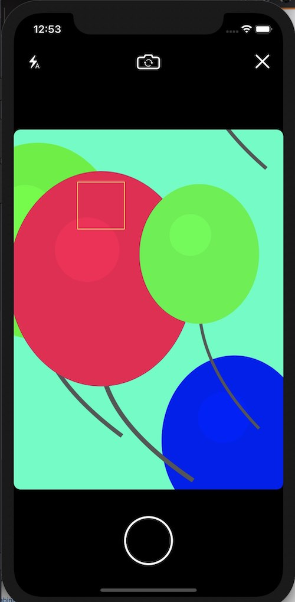

<h1 align="center">
    🎈 React Native Camera Kit
</h1>

<p align="center">
  A <strong>high performance, fully featured, rock solid</strong><br>
  camera library for React Native applications
</p>

<p align="center">
  <a href="https://github.com/teslamotors/react-native-camera-kit/blob/master/LICENSE">
    
  </a>
  <a href="https://www.npmjs.org/package/react-native-camera-kit">
    
  </a>
</p>
<table>
  <tr>
    <td>
      
    </td>
    <td>
      <ul>
        <li><h3>Cross Platform (iOS and Android)</h3></li>
        <li><h3>Optimized for performance and high photo capture rate</h3></li>
        <li><h3>QR / Barcode scanning support</h3></li>
        <li><h3>Camera preview support in iOS simulator</h3></li>
      </ul>
    </td>
  </tr>
</table>

## Installation (RN > 0.60)

```bash
yarn add react-native-camera-kit
```

```bash
cd ios && pod install && cd ..
```

## Running the example project

- `yarn bootstrap`
- `yarn example ios` or `yarn example android`

## Components

### CameraScreen

Full screen camera component that holds camera state and provides camera controls

```js
import { CameraScreen } from 'react-native-camera-kit';
```

```jsx
<CameraScreen
  actions={{ rightButtonText: 'Done', leftButtonText: 'Cancel' }}
  onBottomButtonPressed={(event) => this.onBottomButtonPressed(event)}
  cameraOptions={{ flashMode: 'auto', focusMode: 'on', zoomMode: 'on' }}
  flashImages={{
    on: require('path/to/image'),
    off: require('path/to/image'),
    auto: require('path/to/image'),
  }}
  cameraFlipImage={require('path/to/image')}
  captureButtonImage={require('path/to/image')}
/>
```

#### Barcode / QR Code Scanning

Additionally, the camera screen can be used for barcode scanning

```js
<CameraScreen
  ...
  // Barcode props
  scanBarcode={true}
  laserColor={'blue'}
  frameColor={'yellow'}
  onReadCode={(event) => Alert.alert('Qr code found')} //optional
  hideControls={false} //(default false) optional, hide buttons and additional controls on top and bottom of screen
  showFrame={true} //(default false) optional, show frame with transparent layer (qr code or barcode will be read on this area ONLY), start animation for scanner,that stoped when find any code. Frame always at center of the screen
  offsetForScannerFrame={10} //(default 30) optional, offset from left and right side of the screen
  heightForScannerFrame={300} //(default 200) optional, change height of the scanner frame
  colorForScannerFrame={'red'} //(default white) optional, change colot of the scanner frame
/>
```

### Camera

Barebones camera component

```js
import { Camera } from 'react-native-camera-kit';
```

```jsx
<Camera
  ref={(ref) => (this.camera = ref)}
  type={CameraType.Back} // front/back(default)
  style={{ flex: 1 }}
/>
```

### Camera Props (Optional)

| Props                          | Type                    | Description                                                                                                                                                                                                                                                                                                                                   |
| ------------------------------ | ----------------------- | --------------------------------------------------------------------------------------------------------------------------------------------------------------------------------------------------------------------------------------------------------------------------------------------------------------------------------------------- |
| `flashMode`                    | `'on'`/`'off'`/`'auto'` | Camera flash mode. Default: `auto`                                                                                                                                                                                                                                                                                                            |
| `focusMode`                    | `'on'`/`'off'`          | Camera focus mode. Default: `on`                                                                                                                                                                                                                                                                                                              |
| `zoomMode`                     | `'on'`/`'off'`          | Enable pinch to zoom camera. Default: `on`                                                                                                                                                                                                                                                                                                    |
| `ratioOverlay`                 | `['int':'int', ...]`    | Show a guiding overlay in the camera preview for the selected ratio. Does not crop image as of v9.0. Example: `['16:9', '1:1', '3:4']`                                                                                                                                                                                                        |
| `ratioOverlayColor`            | Color                   | Any color with alpha. Default: `'#ffffff77'`                                                                                                                                                                                                                                                                                                  |
| `resetFocusTimeout`            | Number                  | iOS only. Dismiss tap to focus after this many milliseconds. Default `0` (disabled). Example: `5000` is 5 seconds.                                                                                                                                                                                                                            |
| `resetFocusWhenMotionDetected` | Boolean                 | iOS only. Dismiss tap to focus when focus area content changes. Native iOS feature, see documentation: https://developer.apple.com/documentation/avfoundation/avcapturedevice/1624644-subjectareachangemonitoringenabl?language=objc). Default `true`.                                                                                        |
| `saveToCameraRoll`             | Boolean                 | Using the camera roll is slower than using regular files stored in your app. On an iPhone X in debug mode, on a real phone, we measured around 100-150ms processing time to save to the camera roll. _<span style="color: red">**Note:**</span> This only work on real devices. It will hang indefinitly on simulators._                      |
| `saveToCameraRollWithPhUrl`    | Boolean                 | iOS only. If true, speeds up photo taking by about 5-50ms (measured on iPhone X) by only returning a [rn-cameraroll-compatible](https://github.com/react-native-community/react-native-cameraroll/blob/a09af08f0a46a98b29f6ad470e59d3dc627864a2/ios/RNCAssetsLibraryRequestHandler.m#L36) `ph://..` URL instead of a regular `file://..` URL. |  |

### Barcode Props (Optional)

| Props          | Type     | Description                                                                                                                                                                                |
| -------------- | -------- | ------------------------------------------------------------------------------------------------------------------------------------------------------------------------------------------ |
| `scanBarcode`  | Boolean  | Enable barcode scanner. Default: `false`                                                                                                                                                   |
| `showFrame`    | Boolean  | Show frame in barcode scanner. Default: `false`                                                                                                                                            |
| `laserColor`   | Color    | Color of barcode scanner laser visualization. Default: `red`                                                                                                                               |
| `frameColor`   | Color    | Color of barcode scanner frame visualization. Default: `yellow`                                                                                                                            |
| `surfaceColor` | Color    | Color of barcode scanner surface visualization. Default: `blue`                                                                                                                            |
| `onReadCode`   | Function | Callback when scanner successfully reads barcode. Returned event contains `codeStringValue`. Default: `null`. Ex: `onReadCode={(event) => console.log(event.nativeEvent.codeStringValue)}` |

### Imperative API

_Note: Must be called on a valid camera ref_

#### capture({ ... })

Capture image (`{ saveToCameraRoll: boolean }`). Using the camera roll is slower than using regular files stored in your app. On an iPhone X in debug mode, on a real phone, we measured around 100-150ms processing time to save to the camera roll.

```js
const image = await this.camera.capture();
```

#### checkDeviceCameraAuthorizationStatus (iOS only)

```js
const isCameraAuthorized = await Camera.checkDeviceCameraAuthorizationStatus();
```

return values:

`AVAuthorizationStatusAuthorized` returns `true`

`AVAuthorizationStatusNotDetermined` returns `-1`

otherwise, returns `false`

#### requestDeviceCameraAuthorization (iOS only)

```js
const isUserAuthorizedCamera = await Camera.requestDeviceCameraAuthorization();
```

`AVAuthorizationStatusAuthorized` returns `true`

otherwise, returns `false`

## Contributing

- Pull Requests are welcome, if you open a pull request we will do our best to get to it in a timely manner
- Pull Request Reviews are even more welcome! we need help testing, reviewing, and updating open PRs
- If you are interested in contributing more actively, please contact us.

## License

The MIT License.

See [LICENSE](LICENSE)
